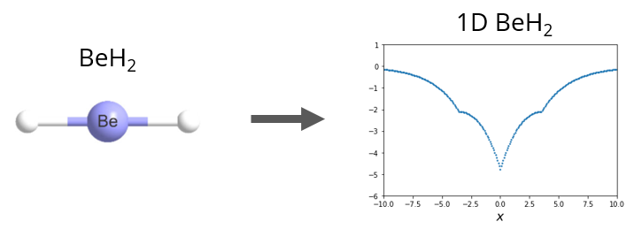

Density Functional Theory (DFT) solver for 1-dimensional
systems.  
===============================

## Overview

DFT_1d is a library for performing 1D DFT calculations and analysis. Kohn-Sham (KS) DFT, Hartree-Fock (HF), and density matrix renormalization group (DMRG) modules are provided. 



1D analog systems are created to mimic realistic 3D counterparts by replacing the $1/r$ Coulombic interaction with an exponential of the form $A e^{-\kappa |x|}$.

Installation (Linux)
------------

* Since we use fixed JAX versions (to prevent future non-compatibility issues), a python virtual environment is recommended. To install, use the following example command:
```
$ git clone https://github.com/pedersor/DFT_1d.git
$ cd DFT_1d
$ pip install .
```

Tutorial
------------
We recommend to first follow the tutorials in [`examples/1d_solver.ipynb`](https://colab.research.google.com/github/pedersor/DFT_1d/blob/master/examples/1d_solver.ipynb) and `examples/tutorial.py`.

## Disclaimer
This library is in *alpha*.
